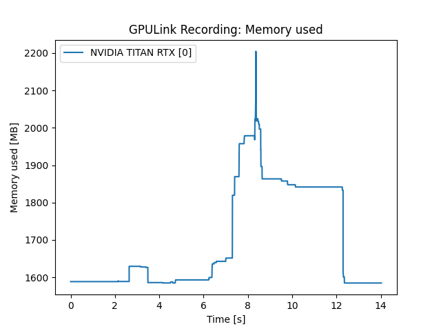

# gpulink
A Python tool for monitoring and displaying GPU stats.  
gpulink can be executed from command-line or can be integrated into Python scripts easily.

## Project status
| Feature           | Status | Notes |
|-------------------|--------|-------|
| Record GPU memory | ✅      |       |
| Plot GPU memory   | ✅      |       |


## Installation

### Using pip (upcoming)
`pip install gpulink`

### From source
1. Create a virtual python environment: `python -m venv env`
2. Enter the environment: `.\env\Scripts\Activate`
3. Install python packages: `pip install -r requirements.txt`

## Usage
```
usage: gpu-link.py [-h] [-o OUTPUT]

GPU-Link memory tracing

optional arguments:
  -h, --help            show this help message and exit
  -o OUTPUT, --output OUTPUT
                        Path to memory graph plot.
```

## Example
1. Run recording  
(a) Installed from source: `python -m gpulink -o memory_consumption.png`  
(b) Installed using pip: `gpulink -o memory_consumption.png`
2. Stop recording *Ctrl+C*
3. Plot is saved to `memory_consumption.png`.

### Output
```
NVIDIA TITAN RTX[0] -> memory used: min=1729.236992[MB] / max=2315.79648[MB]
```


## Scripting
gpulink can be easily used from Python. An example script can be found in `example/example_basic.py`.
To integrate gpulink to a Python script, import gpulink and create an `NVContext` as follows:
```
import gpulink as gpu

with gpu.NVContext() as ctx:
```
Every subsequent gpulink call must be made within this context. The context provides also additional information, i.e.
about the numbers and names of compatible GPU devices:
```
    print(f"Available GPUs: {ctx.gpu_names}")
```
gpulink provides recorders for capturing and storing GPU stats and plotters for rendering these:
```
    recorder = gpu.MemoryRecorder(ctx)
    mem_info = recorder.record(store=False)

    for _ in range(5):  # Record memory information over time
        recorder.record()

    records = recorder.get_records()
    for rec in records:
        print(f"Sampling rate: {rec.sampling_rate}")
        print(f"Recording duration: {rec.duration}")
        print(f"Number of records: {rec.len}")
        print(rec)

    graph = gpu.MemoryPlotter(records)
    graph.draw_graph()
```

